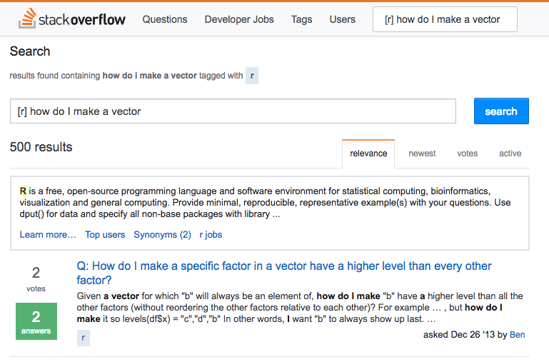

> "There’s an implied contract between you and R: it will do the tedious computation for you, but in return, you must be completely precise in your instructions. Typos matter. Case matters." - Hadley Wickham, [R for Data Science](http://r4ds.had.co.nz/workflow-basics.html)

**Open Source**: The raw (`.Rmd`) code used to produce this guide, along with the guide itself, are available on [GitHub](http://github.com/ryansafner/R4EH), and are updated regularly. GitHub does not automatically render HTML, so download the HTML file and open it, or view it where I host it [on my website](http://ryansafner.com/tutorial/R4EH.html). 

**Note to Students**: This is a work in progress, check the date at the top for when this was last updated. This compiles all of my instructions, advice, and examples from econometrics class lectures regarding `R`. It also contains some advanced material that I did not or will not cover in class, but will be useful to know for future data analysis and understanding or diagnosing problems. 

**Note to Everyone Else**: This guide is oriented primarily for my [Econometrics class](http://ryansafner.com/courses/econ480) at Hood College, but should be of wider use to anyone interested in learning `R` for data analysis. Lecture slides, handouts, and guides (both PDFs and source code in R Markdown) are openly available [on GitHub](http://github.com/ryansafner/ECON480/).

**See also my companion guide to using R Markdown** to more effectively manage your entire workflow (text, data analysis, tables, graphs, and citations!) in a single plain text file and make your work reproducible and shareable, also [on GitHub](). This document, for example, was produced in `R Markdown` (see the raw code `.Rmd` file). 

# For First-Timers:   

This guide is meant to be a somewhat comprehensive resource such that you can come back to different sections when you encounter a specific limitation or problem in your own work. I *do not* recommend reading through this guide from start to finish, or in order. 

I would recommend some basic concepts 

# Basic Concepts

## Operating R Studio

- There are a few ways you can use R Studio: 

1. \alert{Command line/Console}: writing each command by itself and copying down the result as needed
    - Great for testing individual commands to see what happens
    - Not reproducible! Not saved! NOT RECOMMENDED!
2. \alert{.R files}: A sequence of commands (and hopefully comments) saved as a script, the entire script is run all at once
    - Can test individual commands in command line and then put good commands in *.R* file 
    - Equivalent to a *.do* file for Stata
    - Reproducible, saved, commented

3. \alert{R Markdown (*.Rmd*) files}: A plain text document written in *R Markdown* language
    - Allows for individual chunks of *R* code to be run individually (great for testing one command instead of all at once)
    - Reproducible, saved, commented as if a normal document 
    - Can write an entire document (text, equations, R commands, figures, tables, etc) with one file! 
    - Can export to html, MS Word, Beamer, etc!
    - Markdown is a language that is intuitive, simple, human- and machine-readable


### Keyboard Shortcuts
  - `Ctrl+2`: move cursor to console
  - `Ctrl` (`Cmd` on Mac)`+Enter`: run current line (from editor) in console
  - `Ctrl` (`Cmd` on Mac)`+Enter`
  - `Uparrow`: retrieve recent commands in console
  - `Ctrl` (`Cmd` on Mac)`+Uparrow`: search previous commands
  - `Option -`: insert assignment operator (`<-`) 
  - `Ctrl` (`Cmd` on Mac)+`Shift+M`: insert pipe operator (`%>%`)
  
## Working Directory (`wd`){#Working-directory}
- *R* assumes a default (often inconvenient) working directory on your computer
    - this is where it thinks it will **load** any files you want to load and **save** anything you want to save by default
- Find out where *R* currently thinks this is with **`getwd()`**
    - this is often Operating System specific, e.g.: 
        - Mac: `/Users/yourusername/`
        - Windows: `C:/Users/yourusername/Documents/`
    - you can move everything you want to load into this folder on your computer (and save everything there too), but this may be inconvenient 
- *Change* the working directory to wherever you plan on keeping your related data and documents with **`setwd("/path/to/folder")`**
    - you can move to a new `wd` *relative* to the current working directory: 
        - move down a folder by typing the folder name with a `/` after i
            - e.g. to move from `/Ryansafner/Documents/` to `/Ryansafner/Documents/Econometrics/`
        - move up one folder in a hierarchy with `..`
           - e.g. to move from `/Ryansafner/Documents/` to `/Ryansafner/Downloads`, use `setwd("../Downloads/")` to move up from the `Documents` folder to `Ryansafner` folder, then down to Downloads

## Packages

- \alert{Packages} are extensions of base `R` designed by users 
    - Remember, `R` is open source, packages are usually published first on [Github](github.com)
    - Official packages distributed and documented through [CRAN](cran.r-project.org/) 
- To use a (previously-installed) package (note the ""), use the `library()` command:  
```
library("packagename")
```
- If you do not have a package, they are easy to install with (note the plural "s")
```
install.packages("packagename")
```
- To install or load multiple packages at once, we can use the `c()` function to select multiple packages (**see below**)

```
library(c("gapminder","ggplot2","dplyr"))
```

## Useful Packages

- There are several packages we will use often (and are featured later in this guide)
    - Packages are often very well-documented with explanations and examples 
    - Google each package for more information
    
\begin{table}
  \begin{tabular}{ll}
  Package name & Use \\ \toprule 
  \texttt{ggplot2} & Rendering beautiful graphics (scatterplots, histograms, etc)\\
  \texttt{stargazer} & Rendering professioanl looking regression output tables\\
  \texttt{dplyr} & Manipulating data much more intuitively\\
  \texttt{sandwich} & More tools for regression, particularly robust SE's\\
  \texttt{tidyverse} & An epic \emph{meta}package of \texttt{ggplot2, dplyr} and other popular packages\\ \bottomrule
  \end{tabular}
\end{table}

## Calculations

- `R` can be used as a calculator 
    - Basic operations `+`, `-`, `*`, `/`
    - More advanced math operators like exponents, logarithms, trigonometric functions, etc

```{r}
2+2
6^2 # 6 to the second power (i.e. squared)
sqrt(100/4) # square root 
log(5) # logarithm
sin(2*pi) # sin
factorial(5) # factorial (e.g. 5!)
choose(2,6) # binomial choose function

# order of operations matters
3*3+4
3*(3+4)
```

- **Note on Notation**: `R` often reports very large (or very small) numbers in scientific notation with `e`
    - For positive `e`: the number of zeros (or digits after the decimal point) to the right of a number 
        - e.g. $1.25e6 = 1.25 \times 10^6 = 1,250,000$
    - For negative `e`: one less than the number of zeros (or digits after the decimal point) to the left of a number 
        - e.g. $1.25e-6 = 1.25 \times 10^{-6} = 0.00000125$
        
## Hints for Writing Code

### Naming Objects 

- Object names cannot start with a digit or contain a space or comma
- FOR THE LOVE OF GOD AVOID SPACES IN GENERAL
    - You've seen webpages intended to be called `"my webpage in html"` turned into `http://my%20webpage%20in%20html.html`
    - Consider both your `R` objects and your files and folder names on your computer...(`/School/ECON_480_Econometrics/Homeworks_and_Data/`)
- It will be wise to adopt some consistent standard for demarcating names:
```
i.use.snake.case
otherPeopleUseCamelCase
some_people_use_underscores
And_aFew.People_RENOUNCEconvention
```

### Commenting

- Always comment your commands! Describe what you are doing so someone else (or you, 5 years later) can understand what is happening and why! 
    - Use the hashtag `#` to start a comment (`R` ignores everything on that line after the hashtag)
    - Can be made its own line or at the end of lines
    - e.g.
```{r writing, eval=FALSE}
# Run regression of y on x, save as reg1
reg1<-lm(y~x, data=mydata) # runs regression using mydata 
summary(reg1$coefficients) # prints coefficients
```

### Managing Your Workflow

- **Save often!**
    - Better yet, ask me about version control and GitHub

## Getting Help

- You can get documentation, explanations, and examples of every command in `R` 
    - simply type `?commandname` or `help("commandname")`
- Meet your new friend: 


- Meet your new *best* friend:



- The **only** way to learn coding is by tweaking existing examples, messing up, and searching the internet for help! 

# Objects

- `R` is an \alert{object-oriented} programming language: 
    - We will almost always store data in **objects** and run **functions** on the objects
        - Objects are assigned values: `myobject<-value` 
            - "**<-**" is the "\alert{assignment operator}", think of it like an $=$ sign 
        - Functions take the form: `functionname(myobject)`
            - See **below** for examples of useful functions for data analysis 
            - Functions can have *other* functions for arguments (the object the function is run on), e.g. 
            
```
round(rnorm(5),2) 
# rnorm(5) takes 5 random draws from a normal distribution
# then round(, 2) rounds the result to 2 decimal places
```

## Vectors

- The simplest data structure in `R` is a \alert{vector}, simply a collection of objects
- To construct a vector, use the "combine/concatenate" function "**`c()`**"
    - **Example**: a vector of the numbers 1 through 5

```{r vector1}
c(1,2,3,4,5)
```

- We can also build vectors via generating series

```{r vector 11}
1:5
```

- We can perform mathematical operations on a vector as a whole:

```{r vector 3}
sum(1:5)
mean(1:5)
```

- 

```{r store.vector.as.x}
x<-c(1,2,3,4,5)
```
- To inspect an object, we simply call it up by name

```{r look.at.x}
x
```

# Other Object Types

## Lists 

- A \alert{list} is a non-atomic vector, meaning you can gather data elements of different classes in one object 

```{r list}
mylist<-list(5, pi, TRUE, 4.3, "cabbage")
class(mylist)
```

- Another great property of lists is that elements of the list can themselves be vectors

```{r}
vectored.list<-list(c(1.82, 1940, 93.20, 192.917),
     c("Orange", "Cyan", "Pink"),
     c(TRUE, FALSE, TRUE, TRUE, FALSE, TRUE, FALSE, FALSE))

str(vectored.list) # look at structure of the list
```

- We can create a **label** for each element in a list, called a `name` 

```{r}
vectored.list<-list(numbers=c(1.82, 1940, 93.20, 192.917), # first element is a vector called 'numbers'
     colors=c("Orange", "Cyan", "Pink"), # second element is a vector called `colors`
     logic=c(TRUE, FALSE, TRUE, TRUE, FALSE, TRUE, FALSE, FALSE)) # third element is a vector called `logic`

vectored.list
```

- The `names` command prints (or changes) the name of the label of each element in the list

```{r}
names(vectored.list) # print the names of the list elements
names(vectored.list)<-c("name1","name2","name3") # rename the lables to 'name1', 'name2', and 'name3'

names(vectored.list) # print new names
vectored.list # print list with new names
```

## Matrix

- Everything thus far has been 1 dimension, but we often work with 2-dimensional data
    - Rows are observations
    - Columns are variables
- A \alert{matrix} 
    - `matrix()` command creates a matrix by column,
        - can define number of rows with `nrow=`, `R` will divide the elements into equal number of columns 
    
```{r}
matrix1<-matrix(c(1,2,3,4,5,6),nrow=3) # make a 3-row matrix
matrix1 
```

## Data Frame

- The most important object in `R` is a **data frame** (what you call a "spreadsheet"), used for statistics, plots, regressions, etc
    - "Rectangular" data, rows are observations, columns are variables 
    - Can hold variables of different classes (e.g. a quantitative variable like income, a character variable like name, etc)
    - In essence, data frames are actually lists (where each list object itself is a vector)
    - All vectors (columns) must have the same length! 

```{r}

df<-data.frame(x = 1:3,
           y = c("a", "b", "c"),
           z = c(TRUE, FALSE, TRUE))
df
```

# Data Classes


- Vectors **must** contain the same type of elements (e.g. numerical or text)
  * Technically this refers to **atomic vectors** (nearly all vectors are atomic)
- Vectors with "mixed" types will convert all elements to the lowest-common denominator, e.g. character
- You can always check the type of vector using **class()**
```{r vector.types}
mixed<-c(5, pi, TRUE, 4.3, "cabbage")
class(mixed)
```

### Numeric

- \alert{Numeric} (aka "double"), as it sounds, can perform mathematical operations
```{r numeric, echo=TRUE, eval=FALSE}
numeric<-c(1,2,3,4,5)
```

- There are two **types** of numeric objects: **double** and **integer** 

### Double

- If numeric values contain decimal points, they are technically called \alert{floating point double} or simply \alert{double} class
- `R` may simply call them numeric, but contrast with integer below 

```{r}
double<-c(pi,2.34,9.99)

class(double)
typeof(double) # will return the more specific type 

is.double(double) # a logical test to see if object is "double" type
is.integer(double) # a logical test to see if object is "integer" type
```

#### Integer

- If numeric values are all whole numbers, they are \alert{integer} class

```{r}
integers<-c(1,2,3,4)
class(integers)
typeof(integers)

is.double(double)
is.integer(double)
```

### Logical

- \alert{Logical} is a series of binary elements or statements that can either be TRUE or FALSE

```{r logical, echo=TRUE,eval=FALSE}
logical<-c(TRUE,FALSE,FALSE,TRUE)
```

- We can perform logical tests with common operators:
    - `<` less than
    - `>` greater than
    - `<=` less than or equal to ($\leq$)
    - `>=` greater than or equal to ($\geq$)
    - `==` is equal to (note two equals signs are needed!)
    - `!=` is not equal to 
    - `%in%` is a member of a set ($\in$)

```{r}
3==4 #is 3 equal to 4?
3<4 # is three less than 4?
3<=4 # is three less than or equal to 4?
3>4 # is three greater than 4?
3!=4 # is three not equal to four?
3 %in% c(0,1,2) # is three in the following set of numbers?
3 %in% c(0,1,2,3) # is three in the following set of numbers?
```

- We are not limited to using numeric data, `R` can also perform logical tests on other classes of variable, like characters (which need quotes): 

```{r}
"red"=="blue" # is red the same as blue?
"red"!="blue" # is red not equal to blue?
political.party<-c("Republican","Democrat") # define political party as a set of Republican and Democrat
"Libertarian" %in% political.party # check if Libertarian is in the set of political parties we created
"Democrat" %in% political.party # check if Democrat is in our set of political parties 
```

- We can also perform more than one test at a time with multiple conditions:
    - `&` AND 
    - `|` OR 

```{r}
2==2 & 2>3 # is 2 equal to 2 AND greater than 3? 
2==2 | 2>3 # is 2 equal to 2 OR greater than 3? 
```

- These commands will become very useful when we want to subset data or look at portions of our data based on some condition

### Character

- \alert{Character} is a string of text: letters, numbers, and symbols, cannot perform mathematical operations
    - Character values require quotation marks around each value 
```{r char, echo=TRUE,eval=FALSE}
character<-c("one","two","7","orange")
```

#### Dates

- Dates are a specific type of character class
- Specific dates
    * Can do days, weeks, months, quarters, years
```{r dates 1}
today<-Sys.Date() #print today's date 
format(today, format="%B %d %Y") # specify how to report date format 

months<-seq(as.Date("2010/1/1"), as.Date("2012/1/1"), "months") # generate sequence of months between Jan 2010 and Jan 2012
months
```

### Factor 

- \alert{Factor} is a special type of character variable, often used to indicate membership in one of several possible categories, called **levels** (e.g. for plotting, or conditional statistics and data work)
```{r factors}
students<-factor(c("freshman", "senior", "senior", "junior", "freshman", 
                   "sophomore", "freshman"))
students # note order is arbitrary
levels(students) #extract unique levels 
nlevels(students) #count the number of levels 
```

```{r factors2}
table(students) #tabulate number of values for each level 
```

#### Ordered Factors

- Factors have ordered `levels()` which control the order on plots and in `table()` 

```{r}
students.o<-ordered(students, levels=c("freshman","sophomore","junior","senior"))
students.o
```

- **Be advised**: when `R` stores and calls factors, it actually stores them as integers [1..k, for k categories] instead of characters (e.g. "freshman"=1, "sophomore"=2), making this a **nominal** variable. This allows for some mathematical operations.
- An **ordered factor** is where the ordering matters (e.g. "small", "medium", "large" coded as 1, 2, 3 in order)

## Checking or Reclassifying Objects

- We can always check the class of an object with `class()` or `typeof()`. 
    - We can perform logical tests `is.numeric()`, `is.factor()`, etc. to see if an object is a specified type
    - We can change the class of an object by redefining it with `as.classname()`, e.g.

```{r class change}
is.numeric(x) # check if x is numeric
is.factor(x) # check if x is a character
x<-as.character(x) # change vector x to a character
class(x)
x<-as.numeric(x) # change vector x back to numeric 
class(x)
```

# Manipulating Objects

## Subsetting Objects

- We often find ourselves wanting to work with only a specific slice of data from a larger dataset
    - e.g. for a dataframe, look only at one or two variables, or look only at members of a category
        - e.g. only females, only age greater than 21
- This requires us to extract or **subset** our data
    - there are many ways to do this in `R` (and some packages, like `dplyr`, `magrittr`, and `tidyverse` make this easier) 
        - we first discuss how `R` keeps track of objects to use this syntax to allow us to extract relevant data
        - then we talk about **conditional** values to extract data using **logical statements** (see above on logical statements)

### Object Indexing 

- `R` objects store multiple values as an ordered list
    - The order of each value is kept as an index number
        - e.g. the first value is [1], the second value is [2], the 82nd value is [82], etc. 

- Use [square brackets] to isolate elements of a vector, index starts at [1]

```{r vector.index}
print(x) # Our original vector 
x[1] # Print first element of x
```

- We can look at specific elements by identifying their index values:

```{r}
x[c(1,3)] # Print first and third elements

x[-c(1,3)] # Print everything EXCEPT first and third elements

```

- We can change specific elements simply by identifying them by index number and redefining them 

```{r}
x[2]<-"7" #Change second element
print(x) #Our new vector
```

- We can also ask how many elements a vector contains with **length()**
```{r length}
length(x)
```

- We can also select elements by (a) logical condition(s)
```{r}
x[x>2] # print elements in x greater than 2

x[x>2 & x<5] # print elements in x greater than 2 AND less than 5

x[x>2 | x<5] # print elements in x greater than 2 OR less than 5 
```

- It is often useful to label values (later, variables) by giving them "names"
```{r names}
myvars<-c(Var1="alpha",Var2=12,Var3="height") #Label name goes first, then =, then the value 
myvars

#We can still call specific values by index position 
myvars[3] #Get 3rd value 

#We can equivalently call up specific values by name 
myvars["Var3"] #Get value of Var3
names(myvars) #List names of all values
names(myvars)[3] #Get name of third value
```

- This become more useful when we try to subset dataframes for analysis:
    - Observations are indexed by row and column `[r,c]`
        - Use one or both indexes to identify specific observations

```{r}
df<-data.frame(x=c("a","b","c"),
               y=c(1,2,3),
               z=c("do","re","me"))

df

# select row 2, column 3 
df[2,3]

# select column 3
df[,3]

# select row 2
df[2,]

# using just one index will always return a column vector (e.g. variable) 
df[3]

df[[3]]
```

- Subsetting by actual position is quite cumbersome, it is easy to subset by `name`
```{r}
names(df)<-c("letter","number","note")

# select letters
df["letter"]

df[["letter"]]

# select letters and notes 
df[c("letter", "note")]
```

- This is extremely common, so `$` provides a quicker way 

```{r}
# select letters
df$letter

# select notes
df$note
```

# Automate all the Things with `function()`s and `for` Loops

## Functions 

- Sometimes it makes sense to write your own function 
- A function has **argument(s)** (inputs) and produces a desired **output** with the following syntax:
```{r, eval=FALSE}

my.function<-function(x){
  argument.using.x
}
```


## `for` Loops

```{r}
library("ggplot2")
# using diamonds dataset in ggplot2

cuts <- levels(diamonds$cut)
means <- rep(NA, length(cuts))
for(i in seq_along(cuts)) {
 sub <- diamonds[diamonds$cut == cuts[i], ]
 means[i] <- mean(sub$price)
}
means
```

```{r}
# using diamonds dataset 
colours <- levels(diamonds$color)
n <- length(colours)
mprice <- rep(NA, n)
mcarat <- rep(NA, n)
for(i in seq_len(n)) {
 set <- diamonds[diamonds$color == colours[i], ]
 mprice[i] <- median(set$price)
 mcarat[i] <- median(set$carat)
}
results <- data.frame(colours, mprice, mcarat)
results
```

## Simulation

```{r}
# Let’s make a virtual coin flip
# 1 = heads, 0 = tails
coin <- c(0, 1)
# we can flip the coin once
flips <- sample(coin, 1, replace = T)
mean(flips)
# we can flip the coin many times
flips <- sample(coin, 10, replace = T)
mean(flips)

flips <- sample(coin, 10000, replace = T)
n <- seq_along(flips)
mean <- cumsum(flips) / n
coin_toss <- data.frame(n, flips, mean)
library(ggplot2)
qplot(n, mean, data = coin_toss, geom = "line") +
 geom_hline(yintercept = 0.5)
```


## Math Operations on Objects

## Redefining Objects

# Importing Data

- `R` can read almost any type of data (with the proper package)
    - Syntax: `newdf<-read("path/to/file")`
        - You'll create a new object (typically dataframe) with the data (e.g. called `newdf`)
        - Use a particular `read` function depending on the data type (see packages below) and package
        - Put the file path of the object in quotes and parentheses

| Package | Function | File Format(s) | 
|----|----|----|
| `foreign` | `read.*()` | `.dta`, `.spss`, etc. |
| `haven` | `read_*()` | `.dta`(13+) | 
| `readr` | `read_csv()` | `.csv` files | 
| `readxl` | `read_excel()` | `.xls`, `.xlsx` files | 
where `*` is a placeholder for the file type 

- Depending on where you saved the downloaded data on your computer, you tell `R` where to load it from
    - If you save/move the data in the same default working directory as `R`, just tell it `newdf<-read("dataname.ext")`
        - Where `read` should be replaced by the proper function above
        - `dataname.etx` is the name of the data file and its file type (e.g. `.csv`, `.xslx`, etc)
        - You can determine where `R` thinks your working directory is again with `getwd()` and change it (poor idea) with `setwd()` (See (Working Directory)[#Working-directory])
    - If you save/move the data in a different folder:
        - `path/to/file` should be the path **relative** to your current working directory, using `..` to move up one directory on your computer and `/` to move through folders 
        - Example: suppose my current working directory is `RyanSafner/Documentss` and I saved my data file in `RyanSafner/Downloads`
            - My relative path would be `../Downloads/dataname.ext`, since I need to move up one directory (from `RyanSafner/Documents` to just `RyanSafner/'`) and then down into the `Downloads/` folder. 

# Data Wrangling, Tidying, and Cleaning

- 90\% of data work is "wrangling" raw data files into something we can actually work with

- **"Tidy"** data, to use Hadley Wickham's term, has: 
    - Columns are variables
    - Rows are observations
    - One type per dataset 
- Tidy data are easy to model, visualize, and aggregate (i.e. run `lm`, `ddply` and `ggplot` with)
- Common causes of "messy" data:
    - column headers are values, not variable names
    - multiple variables are stored in one column
    - variables are stored in both rows and columns
    - multiple types of experimental unit stored in the same table
    - one type of experimental unit stored in multiple tables

## The `dplyr` package

- 

### `dplyr` verbs

| Function | Does | 
|----------|------|
| `filter` | Keep only selected *observations* | 
| `select` | Keep only selected *variables* |
| `arrange` | Reorder rows (e.g. in numerical order) |
| `mutate` | Create new variables | 
| `summarize` | Collapse data into summary statistics| 
| `group_by` | Perform any of the above functions by groups/categories | 

- Syntax for all of these functions is the same: 
```{r, eval=FALSE}
dplyrfunction(dataframe, condition)
# returns a new dataframe
```

- `filter`ing observations examples (with `gapminder`)
```{r}
library("gapminder")
library("dplyr")
# Only look at countries in Africa
filter(gapminder, continent=="Africa")

# Only look at countries in Europe AND 1997
filter(gapminder, continent=="Europe", year==1997)

# Only look at countries in Europe OR Africa
filter(gapminder, continent=="Europe" | continent=="Africa")

# Only look at countries in the set of Europe and Asia 
filter(gapminder, continent %in% c("Europe","Asia"))


```

- `select`ing observations examples (with `gapminder`)
```{r}
library("gapminder")
library("dplyr")
# Only keep country, year, and population variables
select(gapminder, country, year, pop)

# The "starts_with()", "ends_with()", and "contains()" are also useful functions
select(gapminder, starts_with("c"), gdpPercap) # i.e. *C*ountry, *C*ontinent
```

- `rename`ing variables
```{r}
rename(gapminder, population=pop, gdppercapita=gdpPercap)
```

```{r}
# order by year (smallest to largest)
arrange(gapminder, year)

# order by country (reverse alphabetical)
arrange(gapminder, desc(country)) # desc stands for descending()

# order by lifeexp (smallest to largest)
arrange(gapminder, lifeExp)

# order by lifeexp (largest to smallest)
arrange(gapminder, desc(lifeExp)) 

```

- `mutate`ing new variables 

```{r}
# create a GDP variable by multiplying gdpPercap and pop
mutate(gapminder, gdp = gdpPercap * pop)

# Can create multiple variables at once
mutate(gapminder, 
       gdp = gdpPercap * pop,
       gdp_billions = gdp/1000000000)
```

- `summarize`ing variables

```{r}
# get average life expectancy 
summarize(gapminder, mean_life=mean(lifeExp))

# get standard deviation of life expectancy 

summarize(gapminder, sd_life=sd(lifeExp))

# summarize avg life expectancy by continent with "group_by"

by_continent<-group_by(gapminder, continent)
summarize(by_continent, mean_life=mean(lifeExp))

# or by year

by_year<-group_by(gapminder, year)
summarize(by_year, mean_life=mean(lifeExp))

```

- The **pipe operator** `%>%` "pipes" the *output* of the previous command into the *input* of the next command:

```{r}
gapminder %>% # start with gapminder data 
  group_by(continent, year) %>% # use gapminder data to create groups of continents and of years 
  summarize(mean_life = mean(lifeExp)) # use those groups to calculate average life expectancy by group 
```

- The pipe operator `%>%` works across different functions and packages
    - Once you learn it, it's hard to give it up because it shortens your code significantly! 
  
```{r}
library("ggplot2")

# we want to plot the change in average life expectancy by continent over time 

gapminder %>% # start with gapminder data 
  group_by(year, continent) %>% # create groups of years and of continents 
  summarize(mean_life = mean(lifeExp)) %>% # get average life expectancy for each group 
  ggplot(aes(year, mean_life, color = continent))+ # plot this over time 
  geom_point() + geom_smooth(method="lm")
```

```
new <- summarise(diamonds, avg_depth = mean(depth), avg_price = mean(price))
```

# Plotting 

## Base `R`

- Base `R` is very powerful and intuitive to plot, but not very sexy 
- Basic syntax: 

```{r, eval=FALSE}
plottype(data.frame.name$variable)
```

- If using multiple variables, you can avoid `$` by typing the variable names and then telling `R` where the variables come from (a data frame)

```{r, eval=FALSE}
plottype(variable1,variable2, data=data.frame.name)
```

### Histogram

```{r, echo=TRUE, fig.height=4, fig.width=10, warning=FALSE}
library("gapminder")
hist(gapminder$gdpPercap)
```

### Boxplot 

- Boxplots are similar syntax

```{r, fig.height=4}
boxplot(gapminder$gdpPercap)
```

- If we want a boxplot for each category, use `variable.name~category.variable.name` to tell `R` to plot a boxplot **by** category 

```{r, fig.height=4}
boxplot(gdpPercap~continent,data=gapminder)
```

### Scatterplot 

- Scatterplot syntax for plotting is similar to `hist()` and `boxplot()`: `plot(df$x,df$y)`
```{r, fig.height=3.5}
plot(gapminder$gdpPercap, gapminder$lifeExp)
```

## With `ggplot2`

# Summary Statistics

- For some object named `distr`: 

| Function | Result | 
|---|---|
`min(distr)` | Find minimum value | 
`max(distr)` | Find maximum value |
`range(distr)` | Find the range |
`sort(distr)` | Sort values of distribution from smallest to largest |
|`sort(distr)[1]` | Find first value when sorted (equvalient to finding min) | 
|`sort(distr, decreasing=TRUE)` | Sort from largest to smallest |
|`median(distr)` | Find the median |
|`mean(distr)` | Find the mean | 
|`var(distr)` | Find the variance | 
|`sd(distr)` | Find the standard deviation | 
|`table(distr)` | Gives frequency table of categorical variable values | 
|`fivenum(distr)` | Five number summary (min, q1, median, q3, max) |
|`summary(distr)` | Gives min, q1, median, mean, q3, max | 
|`quantile(distr, 0.32)` | Find specific (e.g. 32$^{nd}$) percentile | 
|`summary(factor(distr))` | Lists all unique values in distr |
|`sum(distr)` | Takes the sum of all values in distr | 

# Linear Regression

```{r}
sex<-c("Male", "Female")
marital<-c("Married","Unmarried")
```

